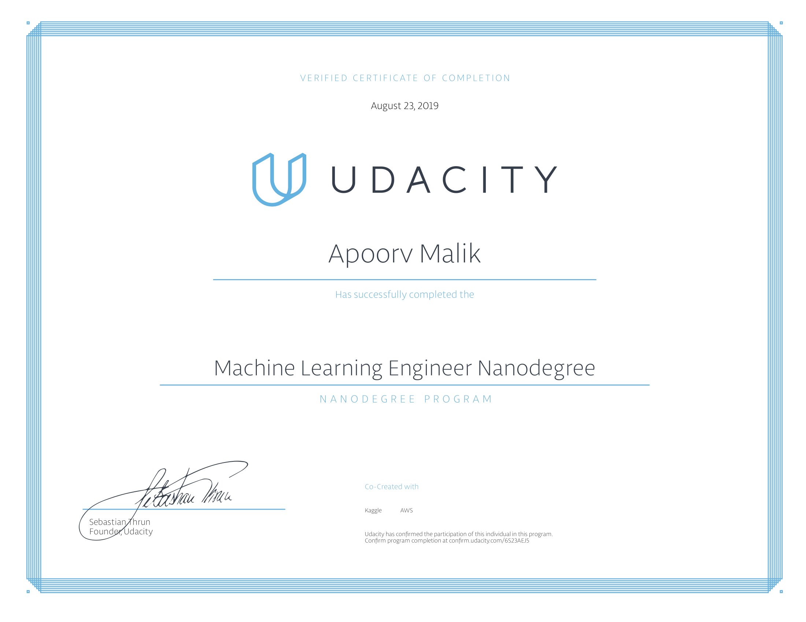

# Udacity Machine Learning Engineer Nanodegree

This repository contains all my nanodegree's project work. I graduated from this program in 2018. Please find the links to the main projects and their description below.

## Certificate

[Verification link](https://confirm.udacity.com/6S23AEJ5)

## Project 1: Predicting Boston Housing Prices

The Boston housing market is highly competitive, and you want to be the best real estate agent in the area. To compete with your peers, you decide to leverage a few basic machine learning concepts to assist you and a client with finding the best selling price for their home. Luckily, you’ve come across the Boston Housing dataset which contains aggregated data on various features for houses in Greater Boston communities, including the median value of homes for each of those areas. Your task is to build an optimal model based on a statistical analysis with the tools available. This model will then be used to estimate the best selling price for your clients' homes.

Go to project: [link](1_predicting_boston_housing_prices/)

## Project 2: Finding Donors for Charity ML

CharityML is a fictitious charity organization located in the heart of Silicon Valley that was established to provide financial support for people eager to learn machine learning. After nearly 32,000 letters were sent to people in the community, CharityML determined that every donation they received came from someone that was making more than $50,000 annually. To expand their potential donor base, CharityML has decided to send letters to residents of California, but to only those most likely to donate to the charity. With nearly 15 million working Californians, CharityML has brought you on board to help build an algorithm to best identify potential donors and reduce overhead cost of sending mail. Your goal will be evaluate and optimize several different supervised learners to determine which algorithm will provide the highest donation yield while also reducing the total number of letters being sent.

Go to project: [link](2_finding_donors_for_charity_ml/)

## Project 3: Creating Customer Segments

A wholesale distributor recently tested a change to their delivery method for some customers, by moving from a morning delivery service five days a week to a cheaper evening delivery service three days a week. Initial testing did not discover any significant unsatisfactory results, so they implemented the cheaper option for all customers. Almost immediately, the distributor began getting complaints about the delivery service change and customers were canceling deliveries — losing the distributor more money than what was being saved. You’ve been hired by the wholesale distributor to find what types of customers they have to help them make better, more informed business decisions in the future. Your task is to use unsupervised learning techniques to see if any similarities exist between customers, and how to best segment customers into distinct categories.

Go to project: [link](3_creating_customer_segments/)

## Project 4: Dog Breed Classifier

Welcome to the Convolutional Neural Networks (CNN) project in the AI Nanodegree! In this project, you will learn how to build a pipeline that can be used within a web or mobile app to process real-world, user-supplied images. Given an image of a dog, your algorithm will identify an estimate of the canine’s breed. If supplied an image of a human, the code will identify the resembling dog breed.

Go to project: [link](4_dog_breed_classifier)

## Project 5: Teaching a Quadcopter how to Fly

The Quadcopter or Quadrotor Helicopter is becoming an increasingly popular aircraft for both personal and professional use. Its maneuverability lends itself to many applications, from last-mile delivery to cinematography, from acrobatics to search-and-rescue. Most quadcopters have 4 motors to provide thrust, although some other models with 6 or 8 motors are also sometimes referred to as quadcopters. Multiple points of thrust with the center of gravity in the middle improves stability and enables a variety of flying behaviors. But it also comes at a price–the high complexity of controlling such an aircraft makes it almost impossible to manually control each individual motor's thrust. So, most commercial quadcopters try to simplify the flying controls by accepting a single thrust magnitude and yaw/pitch/roll controls, making it much more intuitive and fun. The next step in this evolution is to enable quadcopters to autonomously achieve desired control behaviors such as takeoff and landing. You could design these controls with a classic approach (say, by implementing PID controllers). Or, you can use reinforcement learning to build agents that can learn these behaviors on their own. This is what you are going to do in this project!

Go to project: [link](5_teaching_a_quadcopter_how_to_fly)

## Project 6: ML Capstone

### Capstone Project Overview

In this capstone project, you will leverage what you've learned throughout the Nanodegree program to solve a problem of your choice by applying machine learning algorithms and techniques. You will first **define** the problem you want to solve and investigate potential solutions and performance metrics. Next, you will **analyze** the problem through visualizations and data exploration to have a better understanding of what algorithms and features are appropriate for solving it. You will then **implement** your algorithms and metrics of choice, documenting the preprocessing, refinement, and postprocessing steps along the way. Afterwards, you will collect **results** about the performance of the models used, visualize significant quantities, and validate/justify these values. Finally, you will construct **conclusions** about your results, and discuss whether your implementation adequately solves the problem.

### Capstone Project Highlights

This project is designed to prepare you for delivering a polished, end-to-end solution report of a real-world problem in a field of interest. When developing new technology, or deriving adaptations of previous technology, properly documenting your process is critical for both validating and replicating your results.

Things you will learn by completing this project:

- How to research and investigate a real-world problem of interest.
- How to accurately apply specific machine learning algorithms and techniques.
- How to properly analyze and visualize your data and results for validity.
- How to document and write a report of your work.

Go to project: [link](6_ml_capstone)
